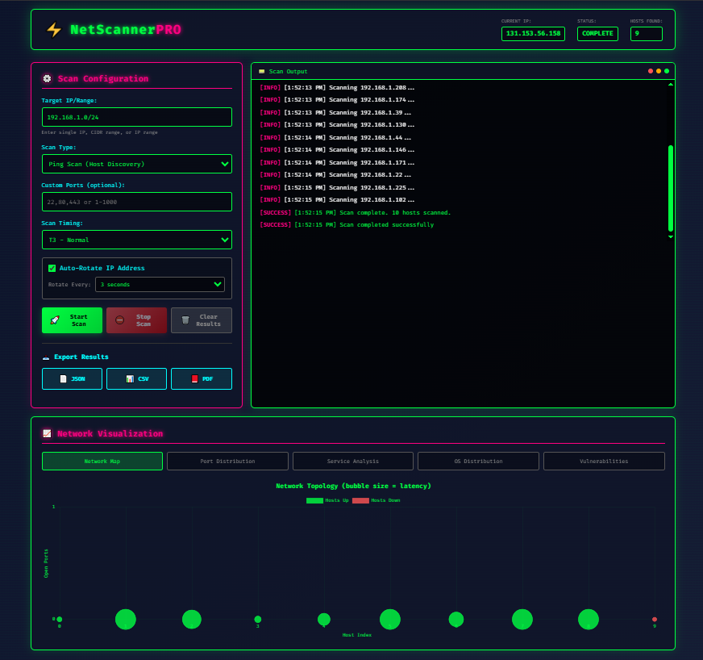
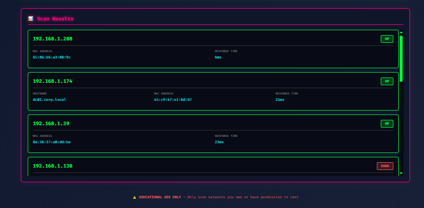

<div align="center">

# NetScanner Pro

### Real nmap-Powered Web Network Scanner

[](https://github.com/aingram702/netscan.net)
[](https://www.python.org/)
[](https://nmap.org/)
[](https://flask.palletsprojects.com/)
[](LICENSE)

A web-based network scanner that wraps **real nmap** with a modern UI, real-time NDJSON streaming, 5 interactive Chart.js visualizations, proxychains integration, and professional PDF report generation.

**This tool performs real network scans.** All data comes from actual nmap output - no simulations.

---

[Quick Start](#-quick-start) | [Scan Types](#-scan-types) | [Proxychains](#-proxychains) | [Architecture](#-architecture) | [API](#-api-reference) | [Security](#-security)

</div>

---

> **LEGAL NOTICE**: Only scan networks you own or have explicit written authorization to test. Unauthorized scanning is illegal under the CFAA and similar laws worldwide.

---



## Table of Contents

- [Quick Start](#-quick-start)
- [Home Assistant Add-on](#-home-assistant-add-on)
- [Prerequisites](#prerequisites)
- [Scan Types](#-scan-types)
- [Timing Profiles](#-timing-profiles)
- [Proxychains](#-proxychains)
- [Features](#-features)
- [Architecture](#-architecture)
- [Project Structure](#-project-structure)
- [API Reference](#-api-reference)
- [Security](#-security)
- [Troubleshooting](#-troubleshooting)
- [Contributing](#-contributing)
- [License](#-license)

---


## Features

| Category | Highlights |
|----------|-----------|
| **Scanning** | 9 scan types including vulnerability detection, UDP scanning, and aggressive all-in-one mode |
| **Speed** | 5 timing profiles (T1-T5) inspired by nmap, from stealthy to maximum throughput |
| **Targeting** | Single IPs, CIDR notation (`/8` to `/32`), IP ranges, and custom port specifications |
| **Proxychains** | Route scans through SOCKS4/5 or HTTP proxy chains for anonymity. Supports strict, dynamic, and random chain types |
| **Visualization** | 5 interactive Chart.js tabs - network topology, port distribution, services, OS fingerprints, vulnerabilities |
| **Vulnerability DB** | Real-world CVE extraction from nmap script output with CVSS severity parsing |
| **Export** | JSON, CSV (with injection protection), and professional PDF reports with embedded charts |
| **Real-time** | NDJSON streaming delivers results as each host is scanned - no waiting for completion |
| **Security** | CSP headers, rate limiting, input sanitization, path traversal prevention, XSS protection |

---

## Quick Start

### Prerequisites

- **Python 3.8+** with pip
- **nmap** installed and in PATH
- **Modern web browser** (Chrome, Firefox, Safari, Edge)
- **proxychains4** (optional) - for routing scans through proxies

### Install nmap

```bash
# Ubuntu/Debian
sudo apt install nmap

# macOS
brew install nmap

# Fedora/RHEL
sudo dnf install nmap

# Arch
sudo pacman -S nmap

# Windows - download from https://nmap.org/download.html
```

### Install proxychains (optional)

```bash
# Ubuntu/Debian
sudo apt install proxychains4

# macOS
brew install proxychains-ng

# Fedora/RHEL
sudo dnf install proxychains-ng

# Arch
sudo pacman -S proxychains-ng
```

### Install & Run

```bash
# Clone
git clone https://github.com/aingram702/netscan.net.git
cd netscan.net

# Install Python dependencies
pip install -r requirements.txt

# Run (unprivileged - some scans limited)
python server.py

# Run with full capabilities (recommended)
sudo python server.py
```

Open **http://localhost:5000** in your browser.

### Root vs Unprivileged

| Privilege Level | Available Scans | Limitations |
|----------------|----------------|-------------|
| **root / sudo** | All 9 scan types | None |
| **unprivileged** | ping, quick, full, service, vuln | Stealth falls back to TCP connect. OS detection disabled. UDP scan blocked. Aggressive scan limited. |

> The server auto-detects privilege level and shows it in both the terminal startup banner and the web UI header.

---

## Home Assistant Add-on

NetScanner Pro can run as a **Home Assistant add-on** with full sidebar integration.

### Add-on Store (remote repository)

1. Go to **Settings > Add-ons > Add-on Store**
2. Click the three-dot menu (top right) > **Repositories**
3. Add: `https://github.com/aingram702/netscan.net`
4. Find **NetScanner Pro** and click **Install**
5. Click **Start** - it appears as **NetScanner** in the sidebar

### Local Add-on (manual)

```bash
cd /addons
git clone https://github.com/aingram702/netscan.net.git netscan
```

Then refresh the add-on store - NetScanner Pro appears under **Local add-ons**.

### How It Works

| Feature | Details |
|---------|---------|
| **Sidebar** | Appears as "NetScanner" with a `mdi:lan` icon via HA ingress |
| **Network** | Runs with `host_network: true` so nmap can reach your LAN |
| **Auth** | Protected by HA's authentication - no separate login needed |
| **Container** | Debian-based Docker image with nmap and proxychains4 pre-installed |
| **Port** | Listens on port 5000 internally; accessed through HA's ingress proxy |

> The add-on runs as root inside the container, giving full access to all 9 scan types without limitations.

---

## Scan Types

Each scan type maps directly to real nmap flags:

| Scan Type | nmap Flags | Description | Root Required |
|-----------|-----------|-------------|:------------:|
| **Ping Scan** | `-sn` | Host discovery only. No port scanning. | No |
| **Quick Scan** | `-F` | Top 100 most common ports. | No |
| **Full Scan** | `-p 1-65535 -sV` | All 65,535 TCP ports with service detection. Slow. | No |
| **Stealth Scan** | `-sS` | SYN half-open scan. Falls back to `-sT` without root. | Yes |
| **Service Detection** | `-sV` | Identifies service names and versions on open ports. | No |
| **OS Detection** | `-O -sV` | Operating system fingerprinting + service detection. | Yes |
| **UDP Scan** | `-sU --top-ports 100` | Top 100 UDP ports (DNS, SNMP, NTP, etc). | Yes |
| **Vulnerability Scan** | `-sV --script vuln` | Runs nmap's vulnerability scripts. Extracts CVEs from output. | No |
| **Aggressive Scan** | `-A` | OS + services + scripts + traceroute. Most comprehensive. | Yes |

### Target Formats

| Format | Example | Description |
|--------|---------|-------------|
| Single IP | `192.168.1.1` | Scan one host |
| CIDR | `10.0.0.0/24` | Scan a subnet (minimum /8) |
| IP Range | `192.168.1.1-192.168.1.254` | Scan a specific range |
| Hostname | `example.com` | DNS-resolved scan |

### Custom Ports

Specify in the custom ports field:
```
22,80,443           # Individual ports
1-1000              # Port range
22,80,443,8000-9000 # Mixed
```

### Skip Host Discovery (-Pn)

Enable the "Skip Host Discovery" checkbox to treat all hosts as online. Useful when targets block ICMP/ping probes.

---

## Timing Profiles

Maps directly to nmap's `-T` templates:

| Profile | nmap Flag | Scan Speed | Use Case |
|---------|----------|------------|----------|
| **T1 - Sneaky** | `-T1` | Very slow | IDS/IPS evasion |
| **T2 - Polite** | `-T2` | Slow | Low-bandwidth networks |
| **T3 - Normal** | `-T3` | Default | General purpose |
| **T4 - Aggressive** | `-T4` | Fast | Reliable LANs |
| **T5 - Insane** | `-T5` | Very fast | Speed over accuracy |

---

## Proxychains

NetScanner Pro can route scans through proxy chains using **proxychains4**, providing anonymity and allowing scans through SOCKS4, SOCKS5, or HTTP proxies.

### How It Works

1. Enable "Route through Proxychains" in the scan configuration
2. Select a chain type (dynamic, strict, or random)
3. Add one or more proxy servers (up to 10)
4. Start your scan - traffic is routed through the proxy chain

### Chain Types

| Chain Type | Behavior |
|-----------|----------|
| **Dynamic** | Skips dead proxies, continues through the rest of the chain |
| **Strict** | All proxies must be online; traffic flows through each in order |
| **Random** | Rotates proxy selection per TCP connection for maximum anonymity |

### Proxy Compatibility

When proxychains is active, the scanner automatically adjusts for proxy constraints:

| Adjustment | Reason |
|-----------|--------|
| Force `-sT` (TCP connect) | Raw SYN packets bypass proxies |
| Remove `-O` (OS detection) | Requires raw packets that bypass proxies |
| Replace `-A` with `-sV -sC --traceroute` | Aggressive mode includes OS detection |
| Add `-Pn` (skip ping) | ICMP does not traverse TCP proxies |
| Block ping scan | ICMP-only scan cannot be proxied |
| Block UDP scan | UDP does not traverse TCP proxies |

### Proxy Formats

Each proxy entry requires:
- **Type**: `socks5`, `socks4`, or `http`
- **Host**: IP address or hostname of the proxy server
- **Port**: Port number (1-65535)

Common default ports: Tor (9050), SSH SOCKS (1080), HTTP proxy (8080).

---

## Architecture

```
 ┌─────────────────────────────────────────────────────────────┐
 │                     Browser (Client)                        │
 │                                                             │
 │  index.html    script.js       styles.css     CDN Libs      │
 │  UI layout     Scan control    Dark theme     Chart.js      │
 │                NDJSON parse    Responsive     jsPDF          │
 │                5 charts                                     │
 │                Proxychains UI                               │
 │                PDF/CSV/JSON                                 │
 └────────────────────┬────────────────────────────────────────┘
                      │ POST /api/scan (NDJSON stream)
                      ▼
 ┌─────────────────────────────────────────────────────────────┐
 │                  Flask Backend (server.py)                   │
 │                                                             │
 │  /api/scan ──→ python-nmap ──→ nmap binary                 │
 │            └──→ proxychains4 ──→ nmap binary (when proxied) │
 │                                                             │
 │  Flow:                                                      │
 │  1. Validate target, scan type, & proxy config              │
 │  2. For ranges: ping sweep → discover live hosts            │
 │     (skipped when proxychains active)                       │
 │  3. Scan each host with requested nmap flags                │
 │  4. Parse XML output → JSON                                 │
 │  5. Stream results as NDJSON (one JSON per line)            │
 │                                                             │
 │  Security: CSP, rate limiting, input sanitization,          │
 │            path traversal prevention, CORS                  │
 └────────────────────┬────────────────────────────────────────┘
                      │ subprocess
                      ▼
 ┌─────────────────────────────────────────────────────────────┐
 │              proxychains4 (optional wrapper)                 │
 │  Routes nmap TCP traffic through SOCKS/HTTP proxy chain     │
 │  Temp config generated per-scan, cleaned up after           │
 └────────────────────┬────────────────────────────────────────┘
                      │
                      ▼
 ┌─────────────────────────────────────────────────────────────┐
 │                    nmap (system binary)                      │
 │  Performs actual network scanning, service detection,        │
 │  OS fingerprinting, vulnerability script execution           │
 └─────────────────────────────────────────────────────────────┘
```

### How Streaming Works

1. **Range scans**: First a quick ping sweep (`-sn`) discovers live hosts. Then each host is scanned individually with the requested flags, streaming results as they complete. (Ping sweep is skipped when proxychains is active since ICMP doesn't traverse proxies.)
2. **Single host scans**: nmap runs once on the target and results are streamed back.
3. **Frontend**: Uses `ReadableStream` API to parse NDJSON line-by-line, updating the terminal, result cards, and charts in real-time.

---

## Project Structure

```
netscan.net/
├── server.py           # Flask backend - nmap wrapper, proxychains integration,
│                       #   NDJSON streaming, result parsing, export, security
├── script.js           # Frontend - scan control, NDJSON parsing, proxychains UI,
│                       #   5 Chart.js visualizations, PDF/CSV/JSON export
├── index.html          # UI shell - scan config, proxychains panel, terminal,
│                       #   charts, results
├── styles.css          # Dark theme, port states, vuln severity, proxy styles
├── requirements.txt    # Flask, flask-cors, python-nmap
├── exports/            # Server-side JSON exports (auto-cleaned)
├── config.yaml         # Home Assistant add-on metadata
├── build.yaml          # HA add-on build config (per-architecture base images)
├── Dockerfile          # HA add-on container build
├── run.sh              # HA add-on container entry point
├── DOCS.md             # HA add-on documentation tab
└── README.md           # This file
```

---

## API Reference

### `GET /api/health`

Returns server status, nmap availability, proxychains availability, privilege level, and source IP.

```json
{
  "status": "ok",
  "service": "NetScanner Pro API",
  "version": "3.1.0",
  "nmap": { "available": true, "version": "7.94", "status": "available" },
  "privileges": { "root": true, "note": "Full scan capabilities" },
  "proxychains": { "available": true, "path": "proxychains4" },
  "source_ip": "192.168.1.100",
  "timestamp": "2025-01-15T10:30:00"
}
```

### `POST /api/scan`

Starts a real nmap scan. Returns NDJSON stream. Rate limited to 10/min.

**Request:**
```json
{
  "target": "192.168.1.0/24",
  "scanType": "aggressive",
  "ports": "22,80,443",
  "timing": 4,
  "skipDiscovery": false,
  "proxychains": {
    "enabled": true,
    "chainType": "dynamic",
    "proxies": [
      { "type": "socks5", "host": "127.0.0.1", "port": 9050 }
    ]
  }
}
```

| Field | Type | Required | Description |
|-------|------|:--------:|-------------|
| `target` | string | Yes | IP, CIDR (/8-/32), IP range, or hostname |
| `scanType` | string | Yes | `ping`, `quick`, `full`, `stealth`, `service`, `os`, `udp`, `vuln`, `aggressive` |
| `ports` | string | No | Custom port spec (e.g., `22,80,443`) |
| `timing` | int | No | 1-5 (default: 3) |
| `skipDiscovery` | bool | No | Skip ping discovery (`-Pn`) |
| `proxychains` | object | No | Proxychains configuration (see below) |

**Proxychains object:**

| Field | Type | Required | Description |
|-------|------|:--------:|-------------|
| `enabled` | bool | Yes | Enable proxy routing |
| `chainType` | string | Yes | `strict`, `dynamic`, or `random` |
| `proxies` | array | Yes | 1-10 proxy entries |
| `proxies[].type` | string | Yes | `socks4`, `socks5`, or `http` |
| `proxies[].host` | string | Yes | Proxy hostname or IP |
| `proxies[].port` | int | Yes | Proxy port (1-65535) |

**Response:** NDJSON stream with log messages and host results.

### `POST /api/export/json` | `POST /api/export/csv` | `POST /api/export/pdf`

Export scan results. Body: `{ "results": [...], "target": "...", "scanType": "..." }`

Max 1000 results per export.

### `GET /api/stats`

Returns supported scan types, nmap version, privilege level.

---

## Security

| Protection | Implementation |
|-----------|----------------|
| **Path traversal** | Static files restricted to allowlisted extensions; path normalization |
| **Input sanitization** | Strips null bytes, control chars, injection chars; 255-char limit |
| **nmap argument injection** | Ports validated per-number (1-65535), spaces stripped; scan type allowlisted |
| **XSS prevention** | `textContent` for all user data in DOM; CSP blocks `unsafe-eval` |
| **CSS class injection** | Allowlisted values for dynamic CSS classes (port states, severities) |
| **CSV injection** | `=+-@\t\r` prefixed values escaped on both client and server export |
| **Rate limiting** | 10 req/min per IP, memory-bounded (10K IPs max) |
| **Request size** | Flask `MAX_CONTENT_LENGTH` = 1MB |
| **Security headers** | HSTS, X-Frame-Options DENY, nosniff, Referrer-Policy, Permissions-Policy |
| **CSP** | Script sources restricted to self + CDN domains |
| **CORS** | Restricted to localhost origins |
| **Proxy validation** | Host regex enforced, port range checked, max 10 proxies, chain type allowlisted |
| **Subprocess safety** | Timeout with process kill; no shell execution |
| **CIDR range limit** | Minimum /8 prefix to prevent scanning the entire internet |

---

## Troubleshooting

<details>
<summary><b>nmap not found</b></summary>

Install nmap for your OS:
```bash
sudo apt install nmap        # Debian/Ubuntu
brew install nmap             # macOS
sudo dnf install nmap         # Fedora
```

Verify: `nmap --version`
</details>

<details>
<summary><b>Permission denied / scan limited</b></summary>

Run the server with root:
```bash
sudo python server.py
```

Without root, these scans are limited: stealth (falls back to TCP connect), OS detection (disabled), UDP (blocked), aggressive (no OS/SYN).
</details>

<details>
<summary><b>No hosts found</b></summary>

1. Verify the target is reachable: `ping 192.168.1.1`
2. Enable "Skip Host Discovery" (-Pn) if hosts block ICMP
3. Check your firewall isn't blocking outbound packets
4. Try a single known-up host first
</details>

<details>
<summary><b>Scan takes too long</b></summary>

1. Use T4 or T5 timing for faster scans
2. Use Quick Scan instead of Full Scan
3. Reduce the target range (use /28 instead of /24)
4. Specify only needed ports with custom ports
5. Each host has a 300s timeout - large networks take proportionally longer
</details>

<details>
<summary><b>Proxychains not working</b></summary>

1. Verify proxychains is installed: `proxychains4 --version` or `which proxychains4`
2. Ensure your proxy servers are running and reachable
3. Test manually: `proxychains4 curl http://httpbin.org/ip`
4. Ping and UDP scans cannot be proxied - use TCP-based scan types
5. Check the terminal output for proxy-specific error messages
6. If using Tor, ensure the Tor service is running: `sudo systemctl start tor`
</details>

<details>
<summary><b>Port 5000 in use</b></summary>

```bash
lsof -ti:5000 | xargs kill -9    # Linux/macOS
```

Or change the port at the bottom of `server.py`.
</details>

---

## Contributing

1. Fork the repository
2. Create a feature branch: `git checkout -b feature/my-feature`
3. Make changes and test
4. Commit: `git commit -m "Add feature"`
5. Push and open a Pull Request

---

## License

MIT License - see [LICENSE](LICENSE) for details.

---

<div align="center">

**AUTHORIZED USE ONLY** - Only scan networks you own or have explicit permission to test.

Powered by [nmap](https://nmap.org) | Built with Python, Flask, Chart.js

</div>
